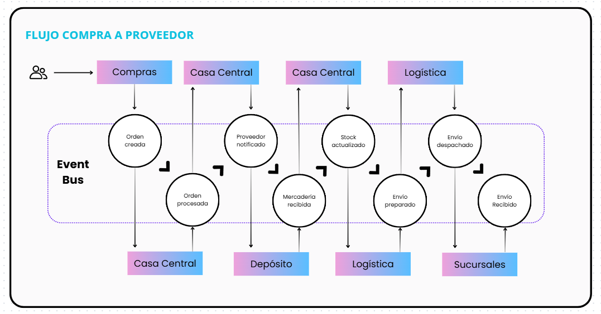

# NBA – Flujo de Compras, Depósito y Logística (AWS)

> **Stack:** API Gateway (HTTP API v2) · AWS Lambda · EventBridge · DynamoDB · SNS  
> **Región:** `us-east-2`  
> **Bus de eventos:** `ventas-bus`

Este repositorio documenta un flujo **event-driven** que orquesta la creación y aprobación de **Órdenes de Compra (OC)**, su **recepción en Depósito**, actualización de **Stock Global**, **despacho** y **notificaciones** por **SNS** hacia aprobadores, proveedor, depósito, logística y sucursales.

---

## 🗺️ Arquitectura (alto nivel)


---

## 🔄 Flujo end-to-end

1) **Crear OC**  
   `POST /ordenes-compra` → **Compras-CrearOrden-CasaCentral**  
   - Guarda OC en `OrdenesCompra` con `status=CREATED`.  
   - Emite **`OrdenCreada`**.

2) **Procesar OC**  
   **CasaCentral-ProcesarOrden-Deposito** (rule: `OrdenCreada`)  
   - Cambia `status=PENDING_APPROVAL`.  
   - Emite **`OrdenPendienteAprobacion`**.

3) **Notificar Aprobadores**  
   **Notificaciones-OC** (rule: `OrdenPendienteAprobacion`)  
   - Envía mail (SNS) con links:  
     - `GET /approvals/{orderId}/approve` → **CasaCentral-AprobarOrden**  
     - `GET /approvals/{orderId}/reject`  → **CasaCentral-RechazarOrden**

4) **Aprobar OC**  
   **CasaCentral-AprobarOrden** (endpoint)  
   - Cambia `status=APPROVED`.  
   - Emite **`OrdenAprobada`** → 2 reglas:  
     - **Notificaciones-Proveedor** (envía detalle a proveedor).  
     - **Notificacion-Deposito** (envía link de recepción).

5) **Rechazar OC**  
   **CasaCentral-RechazarOrden** (endpoint)  
   - Cambia `status=REJECTED`.  
   - (Opcional) Emite `OrdenRechazada`.

6) **Aceptar Recepción (Depósito)**  
   `GET /recepciones/{orderId}/accept` → **Deposito-AceptarRecepcion**  
   - Cambia `status=RECEIVED`.  
   - Suma stock por SKU en **StockGlobal**.  
   - Emite **`RecepcionRecibida`**.

7) **Notificar Logística**  
   **Notificacion-Logistica** (rule: `RecepcionRecibida`)  
   - Envía mail (SNS) con link:  
     - `GET /despachos/{orderId}/confirm` → **Logistica-ConfirmarDespacho**

8) **Confirmar Despacho (Logística)**  
   **Logistica-ConfirmarDespacho** (endpoint)  
   - Upsert en **Envios** (`envioId = orderId`, `status=DISPATCH_CONFIRMED`).  
   - **Resta** stock en **StockGlobal** por SKU (si no alcanza, deja `qty=0`).  
   - Emite **`DespachoConfirmado`**.

9) **Notificar Sucursales** (demo)  
   **Notificaciones-Sucursales** (rule: `DespachoConfirmado`)  
   - Envía **N** mails (SNS) al **mismo topic** usando el nombre de sucursal en el asunto/cuerpo.  
   - Sucursales se eligen aleatoriamente (2 o 3) de `SUCURSALES_DEFAULT`.

---

## 📦 Tablas DynamoDB

| Tabla | PK | Uso | Campos relevantes |
|---|---|---|---|
| **OrdenesCompra** | `orderId` (S) | OC y su ciclo | `status` (`CREATED`, `PENDING_APPROVAL`, `APPROVED`, `REJECTED`, `RECEIVED`), `items` (lista o string JSON), `origen`, `createdAt`, `updatedAt`, `approvedAt`, `receivedAt` |
| **StockGlobal** | `sku` (S) | Stock por SKU | `qty` (Number), `updatedAt`, `lastOrderId` |
| **Envios** | `envioId` (S) = `orderId` | Despachos | `orderId`, `status` (`DISPATCH_CONFIRMED`), `sucursales` (demo), `dispatchedAt`, `confirmedBy` |

> Nota: en el diseño final **no** persistimos “Sucursales” como tabla; solo notificamos por SNS (demo). Si futuro necesitás inventario por sucursal, agregá tabla `Sucursales`.

---

## 📣 SNS (tópicos)

- **COMPRAS_APROBADORES** – aprobadores (links de aprobar/rechazar).
- **PROVEEDORES** – detalle de OC aprobada.
- **DEPOSITO** – aviso con link para confirmar recepción.
- **LOGISTICA** – aviso con link para confirmar despacho.
- **SUCURSALES** – **demo**: un único topic que te llega a vos; el mensaje incluye el nombre de sucursal.

---

## 🌐 API Gateway (HTTP API v2)

| Método/Path | Lambda | Propósito |
|---|---|---|
| `POST /ordenes-compra` | **Compras-CrearOrden-CasaCentral** | Crear OC (`CREATED`) + `OrdenCreada` |
| `GET /approvals/{orderId}/approve` | **CasaCentral-AprobarOrden** | Aprobar (`APPROVED`) + `OrdenAprobada` |
| `GET /approvals/{orderId}/reject` | **CasaCentral-RechazarOrden** | Rechazar (`REJECTED`) + (opcional) `OrdenRechazada` |
| `GET /recepciones/{orderId}/accept` | **Deposito-AceptarRecepcion** | `RECEIVED` + sumar Stock + `RecepcionRecibida` |
| `GET /despachos/{orderId}/confirm` | **Logistica-ConfirmarDespacho** | Upsert `Envios`, restar Stock, `DespachoConfirmado` |

---

## ⏰ EventBridge (bus: `ventas-bus`)

| Regla | Filtro (source / detail-type) | Target |
|---|---|---|
| **OrdenCreada** | `com.casacentral.compras` / `OrdenCreada` | `CasaCentral-ProcesarOrden-Deposito` |
| **PendienteAprobacion** | `com.casacentral.procesos` / `OrdenPendienteAprobacion` | `Notificaciones-OC` |
| **Aprobada→Proveedor** | `com.casacentral.aprobaciones` / `OrdenAprobada` | `Notificaciones-Proveedor` |
| **Aprobada→Deposito** | `com.casacentral.aprobaciones` / `OrdenAprobada` | `Notificacion-Deposito` |
| **RecepcionRecibida** | `com.deposito.recepcion` / `RecepcionRecibida` | `Notificacion-Logistica` |
| **DespachoConfirmado** | `com.logistica.despacho` / `DespachoConfirmado` | `Notificaciones-Sucursales` |

> **Importante:** usar exactamente esos `source`/`detail-type` para que las reglas disparen.

---

## 📨 Contratos de eventos

(ver detalle en la conversación)

---

## ⚙️ Variables de entorno (por Lambda)

(ver tabla completa en la conversación)

---

## 🔐 Permisos IAM (mínimos)

- **DynamoDB:** `GetItem`, `PutItem`, `UpdateItem` en las tablas usadas.  
- **EventBridge:** `events:PutEvents` al `ventas-bus`.  
- **SNS:** `sns:Publish` a los topics configurados.  
- **Logs:** CloudWatch Logs estándar.

---

## 🚀 Cómo probar (end-to-end)

(ver pasos en la conversación)

---

## 🧪 Datos de ejemplo

```json
{
  "orderId": "OC-1001",
  "items": [
    {"sku": "ABC-1234", "qty": 24},
    {"sku": "XYZ-999", "qty": 92}
  ],
  "origen": "Compras"
}
```
